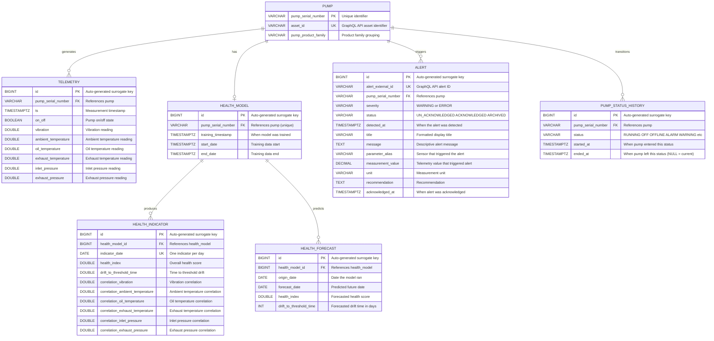

# Multi-Source Virtualization Architecture

## 1. Vision

Neo4j serves as a **topology index** — a navigational layer that captures entity
relationships and just enough materialized data for traversal and filtering. All
detail data stays in its original source (SQL databases, GraphQL APIs) and is
fetched on demand after graph traversal identifies the relevant entities.

This design enables a domain agent to:
- Discover domain structure through graph traversal
- Filter and navigate entities using materialized properties
- Fetch real data values from the authoritative source when needed
- Combine structured data (SQL/GraphQL) with unstructured knowledge (text layer)

```
                Domain Agent (Claude)
               /        |          \
      graph context   structured   raw queries
      (topology)      source       (complex analytics)
           |          queries           |
    Graph Retrievers  query_source  execute_raw_query
           |              |               |
         Neo4j       Schema Template   Schema Template
                      (routing +        (routing +
                       mechanical        validation)
                       query build)
                       /      \          /      \
                  SQL DB   GraphQL   SQL DB   GraphQL
                  API        API
```

The agent never needs to know where data lives. It speaks in domain terms. The
schema template handles routing, field name translation, and source selection
transparently.

---

## 2. Architecture Principles

### 2.1 Neo4j as Topology Wrapper

Every table in the source databases becomes a node label in Neo4j. Every foreign
key becomes a relationship. Each node materializes only:

- **Primary key**: identity, used as lookup key for enrichment from the source
- **Filter columns**: columns the agent would use in `WHERE` clauses during traversal
- **Sort columns**: columns needed for ordering during traversal (e.g., dates)

Everything else is **virtual** — fetched from the source using the node's primary
key after graph traversal identifies the relevant nodes.

### 2.2 Data Source Abstraction

A unified `DataSource` interface abstracts access to SQL databases and GraphQL
APIs behind the same contract. The agent and the enrichment router interact with
the interface, never with raw SQL or GraphQL.

```python
class DataSource(ABC):
    def list_tables(self) -> list[dict]
    def get_schema(self, table: str) -> list[dict]
    def sample_rows(self, table: str, n: int) -> list[dict]
    def read_batches(self, table: str, batch_size: int) -> Iterator[list[dict]]
    def fetch_by_ids(self, table: str, key_column: str,
                     ids: list[str], columns: list[str]) -> list[dict]
    def fetch_related(self, table: str, filters: dict,
                      columns: list[str], order_by: str,
                      limit: int) -> list[dict]
```

Three implementations:

| Implementation | Transport | Use Case |
|---|---|---|
| `SqlDataSource` | DB API 2.0 (psycopg2, pyodbc, sqlite3, etc.) | SQL databases |
| `DatabricksSqlDataSource` | databricks-sql-connector + Unity Catalog SDK | Databricks |
| `GraphQLDataSource` | HTTP + GraphQL queries | GraphQL APIs |

### 2.3 Schema Template as Single Source of Truth

The schema template is a JSON configuration that declares:
- Which data sources exist and how to connect to them
- Which tables become Neo4j nodes and which columns are materialized vs virtual
- Which relationships exist (derived from foreign keys)
- How to translate field names between systems (e.g., snake_case to camelCase)
- How to materialize time series data (strategy per table)
- Text layer configuration (entity types, fact types, linking rules)

Every component reads from this single template:
- **Construction pipeline**: reads `materialize` to import, `relationships` to create edges
- **Enrichment router**: reads `virtual` and `data_source` to fetch on demand
- **Agent**: reads the template to understand what's navigable vs what requires source query

### 2.4 Enrichment Router

After Neo4j traversal returns nodes, the enrichment router:
1. Groups returned nodes by their label
2. Looks up each label's `data_source` and `virtual` columns in the schema template
3. Fetches virtual properties from the correct source using the node's primary key
4. Merges materialized (Neo4j) and virtual (source) data into a unified response

```python
class EnrichmentRouter:
    def __init__(self, template: dict):
        self.template = template
        self._sources: dict[str, DataSource] = {}

    def enrich(self, neo4j_results: list[dict]) -> list[dict]:
        # Group node IDs by label
        by_label = group_by_label(neo4j_results, self.template)

        # Fetch virtual properties per label
        for label, ids in by_label.items():
            config = self.template["nodes"][label]
            if not config.get("virtual"):
                continue
            source = self._get_source(config["data_source"])
            table = config.get("source_table") or config.get("query_field")
            rows = source.fetch_by_ids(table, config["unique_key"], ids,
                                       [config["unique_key"]] + config["virtual"])
            merge_into_results(neo4j_results, label, rows, config)

        return neo4j_results
```

The router handles field name translation for GraphQL sources via `field_map`.

---

## 3. Reference Domain: Pump Health Monitoring

The architecture is illustrated using a pump health monitoring domain where
source data is split across two backends:

| Backend | Type | Tables |
|---|---|---|
| Pump database | SQL (PostgreSQL) | PUMP, TELEMETRY, HEALTH_MODEL, HEALTH_INDICATOR, HEALTH_FORECAST |
| Pump platform API | GraphQL | ALERT, PUMP_STATUS_HISTORY |

### 3.1 Source Data Model



---

## 4. Neo4j Graph Model

### 4.1 Materialized Topology

All source tables are represented in Neo4j. The graph captures the full domain
topology. Five of the seven tables contain time series data and use specific
materialization strategies to control volume.

```
(:Pump {pump_serial_number, asset_id, pump_product_family})
  -[:LATEST_READING]-> (:TelemetrySnapshot {id, ts, on_off, vibration, ...})
  -[:TELEMETRY_ANOMALY]-> (:TelemetryEvent {id, ts, parameter, value, threshold})
  -[:HAS_MODEL]-> (:HealthModel {id, training_timestamp, start_date, end_date})
  -[:TRIGGERS]-> (:Alert {alert_external_id, severity, status, detected_at})
  -[:CURRENT_STATUS]-> (:PumpStatusHistory {id, status, started_at, ended_at})
  -[:STATUS_TRANSITION]-> (:PumpStatusHistory {id, status, started_at, ended_at})

(:HealthModel)
  -[:PRODUCES]-> (:HealthIndicator {id, indicator_date, health_index, drift_to_threshold_time})
  -[:PREDICTS]-> (:HealthForecast {id, origin_date, forecast_date, health_index, drift_to_threshold_time})

Cross-links between time series events:
(:Alert)-[:CORRELATED_WITH]->(:TelemetryEvent)
(:Alert)-[:DURING]->(:PumpStatusHistory)
```

### 4.2 Text Layer (Unstructured Data)

When maintenance reports, inspection logs, or operational manuals are processed,
the graph gains a text layer that connects to the domain topology:

```
(:Chunk {text, embedding}) <-[:FROM_CHUNK]- (:PumpMention)
                           <-[:FROM_CHUNK]- (:Symptom)
                           <-[:FROM_CHUNK]- (:FailureMode)
                           <-[:FROM_CHUNK]- (:MaintenanceAction)

(:PumpMention)-[:CORRESPONDS_TO]->(:Pump)         <- cross-layer link
(:PumpMention)-[:EXHIBITED]->(:Symptom)
(:Symptom)-[:DIAGNOSED_AS]->(:FailureMode)
(:FailureMode)-[:RESOLVED_BY]->(:MaintenanceAction)
```

The `CORRESPONDS_TO` edge between text entities and domain nodes enables
cross-layer queries: "What symptoms have been documented for pumps with
declining health?"

---

## 5. Materialization Strategies

### 5.1 Rationale for the Materialized / Virtual Partition

The partition follows one rule: **materialize what the agent traverses and
filters; virtualize what the agent reads in final answers.**

Materialized columns serve graph navigation:
- Primary keys (node identity, enrichment lookup key)
- Columns used in `WHERE` clauses (severity, status, health_index, dates)
- Columns used in `ORDER BY` (timestamps, dates)

Virtual columns serve presentation and detail:
- Text fields (alert messages, recommendations)
- Diagnostic breakdowns (correlation values)
- Measurement details (specific sensor readings, units)
- Columns only relevant when the agent focuses on a specific entity

This partition minimizes Neo4j storage while maximizing traversal and filtering
capability. The agent can answer "which pumps have health below 0.5 with active
alerts?" entirely within the graph. It only reaches out to the source when it
needs to present "what does the alert say and what's recommended?"

### 5.2 Strategy Definitions

Each time series table declares a `materialization_strategy` in the schema
template that controls how and when data is copied from the source to Neo4j.

#### `full` — All Rows Materialized

Every row in the source table becomes a Neo4j node. Appropriate for tables where
the total volume is manageable and every row has potential graph traversal value.

**When data is copied**: Full load on initial construction. Incremental sync on
subsequent pipeline runs (detect new/changed rows via primary key or timestamp
comparison, MERGE to upsert).

**When to use**: Low-to-moderate volume tables where the agent filters individual
rows by property values.

**Applied to**: HealthIndicator (73K nodes / 100 pumps / 2yr), Alert (15K nodes).

#### `latest` — Most Recent Set Only

Only the most recent batch of rows per parent entity is materialized. Previous
batches are removed from Neo4j on each pipeline run. Historical data remains in
the source.

**When data is copied**: On each pipeline run, delete existing forecast nodes for
the model, then load the current forecast set. This is a replace operation, not
an append.

**When to use**: Tables where only the current prediction/projection matters for
decision-making. Historical versions are analytics data, not navigational data.

**Applied to**: HealthForecast (9K nodes — 90 forecast days per model, latest
run only).

#### `boundary` — Latest Value Per Parent

One node per parent entity, representing the current/most recent reading.
Refreshed (overwritten) on each pipeline run.

**When data is copied**: On each pipeline run, MERGE on the parent's key to
upsert the boundary node with the latest row's values.

**When to use**: High-volume time series where individual rows have no graph
traversal value but the latest state is useful for filtering.

**Applied to**: Telemetry latest reading (100 nodes — one `TelemetrySnapshot` per
pump).

#### `event` — Threshold Crossings Only

Rows are materialized only when they represent a significant state change or
threshold violation. The construction pipeline applies detection logic during
import: compare each reading against defined thresholds and only create nodes
for violations.

**When data is copied**: During pipeline run, the construction logic scans source
data (or a pre-computed anomaly table) and creates event nodes for threshold
crossings. Events are append-only — once created, they persist.

**When to use**: High-volume time series where individual readings add no graph
value but anomalous readings cross-link to other entities (alerts, status
changes) and have real topological meaning.

**Applied to**: Telemetry anomaly events (~2K-5K nodes — `TelemetryEvent` nodes
for readings that exceeded sensor thresholds).

**Threshold configuration** in the schema template:

```json
"TelemetryEvent": {
    "materialization_strategy": "event",
    "event_source": "telemetry",
    "thresholds": {
        "vibration": {"above": 3.5},
        "oil_temperature": {"above": 95.0},
        "exhaust_temperature": {"above": 200.0},
        "inlet_pressure": {"below": 0.5},
        "exhaust_pressure": {"above": 15.0}
    }
}
```

#### `window` — Rolling Time Window

Rows from the last N days are materialized. Older rows are removed from Neo4j
on each pipeline run. The window size is configurable.

**When data is copied**: On each pipeline run, delete nodes older than the window
cutoff, then load new rows within the window. This maintains a sliding view of
recent data.

**When to use**: Tables where recent history has graph traversal value (temporal
correlation with alerts, status filtering) but distant history does not.

**Applied to**: PumpStatusHistory (15K nodes — last 30 days of transitions plus
current status).

### 5.3 Refresh Timing

All materialization happens during pipeline runs. The pipeline can be triggered:

- **Scheduled** (cron / Airflow): e.g., every 6 hours for operational dashboards
- **Event-driven**: triggered by new alert, status change, or model retraining
- **On-demand**: manual pipeline trigger for ad-hoc analysis

Between pipeline runs, materialized data may be stale. The staleness window
equals the pipeline run interval. For the pump health domain:

| Data | Acceptable Staleness | Recommended Interval |
|---|---|---|
| Telemetry snapshot | Minutes to hours | Every 15-60 minutes |
| Health indicators | Hours to 1 day | Daily (indicators are daily) |
| Health forecasts | Days | On model retrain (weekly) |
| Alerts | Minutes | Event-driven or every 15 min |
| Status transitions | Minutes | Event-driven or every 15 min |

For near-real-time requirements, event-driven triggers on the alert and status
tables minimize staleness for the most time-sensitive data.

### 5.4 Volume Analysis (100 Pumps, 2 Years)

| Table | Strategy | Neo4j Nodes | Source Rows | Ratio | Rationale |
|---|---|---|---|---|---|
| Pump | n/a (entity) | 100 | 100 | 100% | Core identity, small |
| HealthModel | n/a (entity) | 100 | 100 | 100% | Anchor node, 1:1 with pump |
| Telemetry | boundary + event | ~5,100 | 21,000,000 | 0.02% | Raw readings have no graph topology value |
| HealthIndicator | full | 73,000 | 73,000 | 100% | Agent filters by health_index, manageable volume |
| HealthForecast | latest | 9,000 | up to 936,000 | ~1% | Only current predictions matter for decisions |
| Alert | full | 15,000 | 15,000 | 100% | Every alert is a meaningful event |
| PumpStatusHistory | window (30d) | ~15,100 | 365,000 | ~4% | Current + recent status for correlation |
| **Total** | | **~117,400** | **~22,389,100** | **0.5%** | |

The graph holds 0.5% of the data — just enough topology for navigation.

### 5.5 Per-Table Materialization Detail

#### Pump (Entity — Full Materialization)

| Column | Materialized | Virtual | Rationale |
|---|---|---|---|
| pump_serial_number | Yes | | PK, node identity |
| asset_id | Yes | | UK, needed for GraphQL cross-reference |
| pump_product_family | Yes | | Grouping/filtering in graph queries |

All 3 columns materialized. Small master table.

#### Telemetry (Time Series — Boundary + Event)

Individual telemetry rows are NOT materialized. Two derived node types instead:

**TelemetrySnapshot** (boundary — 1 per pump):

| Column | Materialized | Virtual | Rationale |
|---|---|---|---|
| id | Yes | | PK, enrichment lookup |
| ts | Yes | | Latest reading timestamp |
| on_off | Yes | | Current pump state |
| vibration | Yes | | Latest reading for quick reference |
| ambient_temperature | | Yes | Detail, fetch on demand |
| oil_temperature | | Yes | Detail, fetch on demand |
| exhaust_temperature | | Yes | Detail, fetch on demand |
| inlet_pressure | | Yes | Detail, fetch on demand |
| exhaust_pressure | | Yes | Detail, fetch on demand |

**TelemetryEvent** (event — anomaly detections):

| Column | Materialized | Virtual | Rationale |
|---|---|---|---|
| id | Yes | | PK, enrichment lookup |
| ts | Yes | | When the anomaly occurred |
| parameter | Yes | | Which sensor (vibration, oil_temp, etc.) |
| value | Yes | | The anomalous reading |
| threshold | Yes | | The threshold that was crossed |

Full time series (21M rows) stays in SQL. Accessed via `query_source` with
pump_serial_number + time range filters.

#### HealthModel (Entity — Full Materialization)

| Column | Materialized | Virtual | Rationale |
|---|---|---|---|
| id | Yes | | PK, node identity |
| training_timestamp | Yes | | When model was trained |
| start_date | Yes | | Training data range start |
| end_date | Yes | | Training data range end |

All columns materialized. Small table (one per pump). `pump_serial_number` is
implicit in the `HAS_MODEL` relationship.

#### HealthIndicator (Time Series — Full Materialization)

| Column | Materialized | Virtual | Rationale |
|---|---|---|---|
| id | Yes | | PK, enrichment lookup |
| indicator_date | Yes | | Date filtering, ordering |
| health_index | Yes | | Core filter: `WHERE health_index < 0.5` |
| drift_to_threshold_time | Yes | | Core filter: `WHERE drift < 30` |
| correlation_vibration | | Yes | Diagnostic detail |
| correlation_ambient_temperature | | Yes | Diagnostic detail |
| correlation_oil_temperature | | Yes | Diagnostic detail |
| correlation_exhaust_temperature | | Yes | Diagnostic detail |
| correlation_inlet_pressure | | Yes | Diagnostic detail |
| correlation_exhaust_pressure | | Yes | Diagnostic detail |

73K nodes fully materialized. Volume is manageable (730 per pump over 2 years).
The 6 correlation columns are diagnostic breakdowns fetched only when the agent
investigates a specific indicator. `health_model_id` is implicit in the
`PRODUCES` relationship.

#### HealthForecast (Time Series — Latest Set Only)

| Column | Materialized | Virtual | Rationale |
|---|---|---|---|
| id | Yes | | PK, enrichment lookup |
| origin_date | Yes | | When forecast was generated |
| forecast_date | Yes | | Predicted date, filtering/ordering |
| health_index | Yes | | Forecasted health, filtering |
| drift_to_threshold_time | Yes | | Forecasted drift, filtering |

All columns materialized for the latest forecast set. 9K nodes (90 per model).
Historical forecasts (up to 936K rows) stay in SQL for model accuracy analysis
via `execute_raw_query`.

#### Alert (Event — Full Materialization)

Source: GraphQL API.

| Column | Materialized | Virtual | Rationale |
|---|---|---|---|
| alert_external_id | Yes | | PK, GraphQL lookup key |
| severity | Yes | | Core filter: WARNING vs ERROR |
| status | Yes | | Core filter: UN_ACKNOWLEDGED / ACKNOWLEDGED / ARCHIVED |
| detected_at | Yes | | Time filtering, ordering |
| title | | Yes | Presentation text |
| message | | Yes | Detail text |
| parameter_alias | | Yes | Which sensor triggered |
| measurement_value | | Yes | The triggering value |
| unit | | Yes | Measurement unit |
| recommendation | | Yes | Action recommendation |
| acknowledged_at | | Yes | Acknowledgment timestamp |

15K nodes fully materialized. Every alert is a meaningful event. Virtual columns
are presentation/action details fetched from GraphQL when the agent focuses on
specific alerts. `pump_serial_number` is implicit in the `TRIGGERS` relationship.

GraphQL field mapping: `alert_external_id` -> `alertExternalId`,
`detected_at` -> `detectedAt`, etc.

#### PumpStatusHistory (Time Series — 30-Day Window)

Source: GraphQL API.

| Column | Materialized | Virtual | Rationale |
|---|---|---|---|
| id | Yes | | PK, GraphQL lookup key |
| status | Yes | | Core filter: RUNNING, ALARM, WARNING, etc. |
| started_at | Yes | | Time filtering, ordering |
| ended_at | Yes | | NULL = current status, used in `WHERE` |

All 4 columns materialized for the rolling window. No virtual columns (small
row width). 15K nodes (30-day window). Full history (365K rows) stays in GraphQL.

Relationship types distinguish current from historical:
- `[:CURRENT_STATUS]` — one per pump, `ended_at IS NULL`
- `[:STATUS_TRANSITION]` — recent transitions within the window

---

## 6. Schema Template

```json
{
    "data_sources": {
        "pump_db": {
            "type": "sql",
            "connection_env": "PUMP_DB_URL"
        },
        "pump_api": {
            "type": "graphql",
            "endpoint_env": "PUMP_GRAPHQL_ENDPOINT",
            "auth": {
                "type": "bearer",
                "token_env": "PUMP_GRAPHQL_TOKEN"
            }
        }
    },
    "nodes": {
        "Pump": {
            "data_source": "pump_db",
            "source_table": "pump",
            "unique_key": "pump_serial_number",
            "materialize": ["pump_serial_number", "asset_id", "pump_product_family"],
            "virtual": []
        },
        "TelemetrySnapshot": {
            "data_source": "pump_db",
            "source_table": "telemetry",
            "unique_key": "id",
            "materialization_strategy": "boundary",
            "materialize": ["id", "ts", "on_off", "vibration"],
            "virtual": ["ambient_temperature", "oil_temperature",
                         "exhaust_temperature", "inlet_pressure",
                         "exhaust_pressure"]
        },
        "TelemetryEvent": {
            "data_source": "pump_db",
            "source_table": "telemetry",
            "materialization_strategy": "event",
            "materialize": ["id", "ts", "parameter", "value", "threshold"],
            "virtual": [],
            "thresholds": {
                "vibration": {"above": 3.5},
                "oil_temperature": {"above": 95.0},
                "exhaust_temperature": {"above": 200.0},
                "inlet_pressure": {"below": 0.5},
                "exhaust_pressure": {"above": 15.0}
            }
        },
        "HealthModel": {
            "data_source": "pump_db",
            "source_table": "health_model",
            "unique_key": "id",
            "materialize": ["id", "training_timestamp", "start_date", "end_date"],
            "virtual": []
        },
        "HealthIndicator": {
            "data_source": "pump_db",
            "source_table": "health_indicator",
            "unique_key": "id",
            "materialization_strategy": "full",
            "materialize": ["id", "indicator_date", "health_index",
                            "drift_to_threshold_time"],
            "virtual": ["correlation_vibration", "correlation_ambient_temperature",
                         "correlation_oil_temperature",
                         "correlation_exhaust_temperature",
                         "correlation_inlet_pressure",
                         "correlation_exhaust_pressure"]
        },
        "HealthForecast": {
            "data_source": "pump_db",
            "source_table": "health_forecast",
            "unique_key": "id",
            "materialization_strategy": "latest",
            "materialize": ["id", "origin_date", "forecast_date",
                            "health_index", "drift_to_threshold_time"],
            "virtual": []
        },
        "Alert": {
            "data_source": "pump_api",
            "source_type": "Alert",
            "query_field": "alerts",
            "unique_key": "alert_external_id",
            "materialization_strategy": "full",
            "field_map": {
                "alert_external_id": "alertExternalId",
                "pump_serial_number": "pumpSerialNumber",
                "detected_at": "detectedAt",
                "parameter_alias": "parameterAlias",
                "measurement_value": "measurementValue",
                "acknowledged_at": "acknowledgedAt"
            },
            "materialize": ["alert_external_id", "severity", "status",
                            "detected_at"],
            "virtual": ["title", "message", "parameter_alias",
                         "measurement_value", "unit", "recommendation",
                         "acknowledged_at"]
        },
        "PumpStatusHistory": {
            "data_source": "pump_api",
            "source_type": "PumpStatusHistory",
            "query_field": "pumpStatusHistory",
            "unique_key": "id",
            "materialization_strategy": "window",
            "window_days": 30,
            "field_map": {
                "pump_serial_number": "pumpSerialNumber",
                "started_at": "startedAt",
                "ended_at": "endedAt"
            },
            "materialize": ["id", "status", "started_at", "ended_at"],
            "virtual": []
        }
    },
    "relationships": {
        "LATEST_READING": {
            "from": "Pump",
            "to": "TelemetrySnapshot",
            "cardinality": "1:1",
            "foreign_key": {"column": "pump_serial_number", "on": "TelemetrySnapshot"}
        },
        "TELEMETRY_ANOMALY": {
            "from": "Pump",
            "to": "TelemetryEvent",
            "cardinality": "1:many",
            "foreign_key": {"column": "pump_serial_number", "on": "TelemetryEvent"}
        },
        "HAS_MODEL": {
            "from": "Pump",
            "to": "HealthModel",
            "cardinality": "1:1",
            "foreign_key": {"column": "pump_serial_number", "on": "HealthModel"}
        },
        "PRODUCES": {
            "from": "HealthModel",
            "to": "HealthIndicator",
            "cardinality": "1:many",
            "foreign_key": {"column": "health_model_id", "on": "HealthIndicator"}
        },
        "PREDICTS": {
            "from": "HealthModel",
            "to": "HealthForecast",
            "cardinality": "1:many",
            "foreign_key": {"column": "health_model_id", "on": "HealthForecast"}
        },
        "TRIGGERS": {
            "from": "Pump",
            "to": "Alert",
            "cardinality": "1:many",
            "foreign_key": {"column": "pump_serial_number", "on": "Alert"}
        },
        "CURRENT_STATUS": {
            "from": "Pump",
            "to": "PumpStatusHistory",
            "cardinality": "1:1",
            "foreign_key": {"column": "pump_serial_number", "on": "PumpStatusHistory"},
            "filter": {"ended_at": null}
        },
        "STATUS_TRANSITION": {
            "from": "Pump",
            "to": "PumpStatusHistory",
            "cardinality": "1:many",
            "foreign_key": {"column": "pump_serial_number", "on": "PumpStatusHistory"}
        },
        "CORRELATED_WITH": {
            "from": "Alert",
            "to": "TelemetryEvent",
            "cardinality": "many:many",
            "join_logic": "temporal_proximity",
            "window_minutes": 30,
            "comment": "Alert and anomaly detected within 30 minutes on same pump"
        },
        "DURING": {
            "from": "Alert",
            "to": "PumpStatusHistory",
            "cardinality": "many:1",
            "join_logic": "temporal_containment",
            "comment": "Alert detected_at falls within status started_at..ended_at"
        }
    },
    "virtual_time_series": {
        "telemetry": {
            "data_source": "pump_db",
            "source_table": "telemetry",
            "anchor_node": "Pump",
            "join_key": "pump_serial_number",
            "columns": ["ts", "on_off", "vibration", "ambient_temperature",
                         "oil_temperature", "exhaust_temperature",
                         "inlet_pressure", "exhaust_pressure"],
            "default_order": "ts DESC",
            "comment": "Full telemetry time series, not materialized as nodes"
        },
        "health_indicator_history": {
            "data_source": "pump_db",
            "source_table": "health_indicator",
            "anchor_node": "HealthModel",
            "join_key": "health_model_id",
            "columns": ["indicator_date", "health_index", "drift_to_threshold_time",
                         "correlation_vibration", "correlation_ambient_temperature",
                         "correlation_oil_temperature",
                         "correlation_exhaust_temperature",
                         "correlation_inlet_pressure",
                         "correlation_exhaust_pressure"],
            "default_order": "indicator_date",
            "comment": "All indicators are materialized as nodes; this entry enables direct time-range queries bypassing graph traversal for bulk analytics"
        },
        "health_forecast_history": {
            "data_source": "pump_db",
            "source_table": "health_forecast",
            "anchor_node": "HealthModel",
            "join_key": "health_model_id",
            "columns": ["origin_date", "forecast_date", "health_index",
                         "drift_to_threshold_time"],
            "default_order": "forecast_date",
            "comment": "Historical forecasts (not in graph). Only latest set is materialized"
        },
        "pump_status_full_history": {
            "data_source": "pump_api",
            "source_type": "PumpStatusHistory",
            "query_field": "pumpStatusHistory",
            "anchor_node": "Pump",
            "join_key": "pump_serial_number",
            "field_map": {
                "pump_serial_number": "pumpSerialNumber",
                "started_at": "startedAt",
                "ended_at": "endedAt"
            },
            "columns": ["status", "started_at", "ended_at"],
            "default_order": "started_at DESC",
            "comment": "Full status history (not in graph). Only last 30 days materialized"
        }
    },
    "text_layer": {
        "sources": ["data/maintenance_reports/*.md", "data/inspection_logs/*.md"],
        "entity_types": {
            "PumpMention": {
                "links_to": "Pump",
                "match_key": "pump_serial_number",
                "description": "Pump references in maintenance text"
            },
            "FailureMode": {
                "description": "Bearing failure, seal leak, overheating, etc."
            },
            "MaintenanceAction": {
                "description": "Repair, replace, inspect, lubricate, etc."
            },
            "Symptom": {
                "description": "Excessive vibration, oil discoloration, noise, etc."
            }
        },
        "fact_types": {
            "EXHIBITED": {
                "subject": "PumpMention",
                "object": "Symptom"
            },
            "DIAGNOSED_AS": {
                "subject": "Symptom",
                "object": "FailureMode"
            },
            "RESOLVED_BY": {
                "subject": "FailureMode",
                "object": "MaintenanceAction"
            }
        }
    }
}
```

---

## 7. Retrievers

The agent has access to two categories of retrievers: **graph retrievers** that
navigate Neo4j topology, and **source retrievers** that fetch real data from SQL
and GraphQL databases.

### 7.1 Graph Retrievers

These operate on Neo4j and provide context — which entities are relevant, how
they connect, what their materialized properties are.

#### Schema Query

Returns the graph structure: labels, relationships, node counts, property keys.
Classifies labels into domain layer (from state) and text layer (Chunk,
Document, __Entity__).

- **Neo4j mechanism**: `db.labels()`, `db.relationshipTypes()`, per-label counts
  and property sampling
- **Infrastructure required**: None (works on any Neo4j graph)
- **Returns**: Formatted schema summary + structured evidence
- **Confidence**: 1.0 (deterministic)
- **When to use**: Agent needs to understand what's in the graph before querying.
  First call in most sessions.

#### Cypher Execution

Executes a read-only Cypher query directly. The agent (or strategy selector)
generates the Cypher. Validates safety before execution: blocks CREATE, DELETE,
SET, REMOVE, MERGE.

- **Neo4j mechanism**: Direct `session.run(query)`
- **Infrastructure required**: None
- **Returns**: Formatted query results + raw records
- **Confidence**: 0.8 if results found, 0.2 if empty
- **When to use**: Structured traversal questions. "Find all pumps with health
  below 0.5 and active alerts." The primary retriever for the topology wrapper
  model.

#### Vector Search

Semantic similarity search on text chunk embeddings. Finds chunks whose content
is semantically close to the question.

- **Neo4j mechanism**: `VectorRetriever` from `neo4j_graphrag.retrievers`
- **Infrastructure required**: `chunk-embeddings` vector index,
  `text-embedding-3-large` embedder (requires OPENAI_API_KEY)
- **Returns**: Matching chunks with similarity scores
- **Confidence**: Based on top score and result count
- **When to use**: Unstructured text questions. "What do maintenance reports say
  about bearing failures?" Only applicable when text layer exists.

#### Hybrid Search

Combined vector similarity + fulltext keyword matching. Better than pure vector
for queries containing specific names, codes, or technical terms.

- **Neo4j mechanism**: `HybridRetriever` from `neo4j_graphrag.retrievers`
- **Infrastructure required**: `chunk-embeddings` vector index +
  `chunk-fulltext` fulltext index + `text-embedding-3-large` embedder
- **Returns**: Matching chunks with combined scores
- **Confidence**: Based on top score and result count
- **When to use**: Text questions with specific identifiers. "What did the
  inspection report say about pump PSN-1234?" Only applicable when text layer
  exists.

#### Cross-Layer Traversal

Hybrid search to find relevant chunks, then graph traversal through
`FROM_CHUNK` to text entities, then `CORRESPONDS_TO` to domain entities.
Bridges the text and structured layers.

- **Neo4j mechanism**: `HybridCypherRetriever` from `neo4j_graphrag.retrievers`
  with custom traversal Cypher and result formatter
- **Infrastructure required**: Both vector and fulltext indexes + text layer
  entities + `CORRESPONDS_TO` edges from entity resolution
- **Traversal pattern**: `(entity)-[:FROM_CHUNK]->(chunk)` then optionally
  `(entity)-[:CORRESPONDS_TO]->(domain_entity)`
- **Returns**: Chunks enriched with entity context and domain entity links
- **Confidence**: Based on score, entity matches, and domain bridge presence
- **When to use**: Questions that span both layers. "What symptoms have been
  documented for pumps with declining health?" Requires both text and domain
  layers to be built.

### 7.2 Source Retrievers

These operate on SQL databases and GraphQL APIs. They fetch real data values
after graph traversal has identified which entities are relevant.

#### query_source (Structured Source Query)

Fetches data from the source database using structured parameters. The schema
template routes to the correct source and translates field names. No SQL or
GraphQL is generated by the agent.

- **Mechanism**: `DataSource.fetch_by_ids()` or `DataSource.fetch_related()`
- **Infrastructure required**: Source database connection (SQL or GraphQL)
- **Parameters**:
  ```
  entity:    str          # "Alert", "HealthIndicator", etc.
  filters:   dict         # {pump_serial_number: "PSN-1234", ts: {gte: "2026-02-01"}}
  columns:   list[str]    # ["title", "message", "recommendation"] or [] for all
  order_by:  str          # "ts DESC"
  limit:     int          # 100
  ```
- **Routing**: Schema template maps entity name to data source + table/query
  field. For GraphQL sources, `field_map` translates snake_case to camelCase.
- **When to use**: Agent knows which entities it wants and needs their actual
  data values. Covers: point lookups by ID, time-range queries, filtered
  selects.

#### execute_raw_query (Agent-Generated SQL / GraphQL)

The agent writes SQL or GraphQL directly for complex analytics that
`query_source` cannot express. Read-only validation, 30-second timeout, 1000-row
cap.

- **Mechanism**: Direct query execution against the specified data source
- **Infrastructure required**: Source database connection
- **Parameters**:
  ```
  data_source:  str    # "pump_db" or "pump_api"
  query:        str    # Raw SQL or GraphQL
  ```
- **Safety**: Read-only validation (blocks INSERT, UPDATE, DELETE, DROP for SQL;
  blocks mutations for GraphQL). Query timeout. Row limit.
- **When to use**: Aggregations, joins, window functions, statistical queries.
  "Average vibration across all pumps this month grouped by product family."
  "Compare forecast accuracy: predicted health vs actual health."

### 7.3 Retriever Selection

The agent decides which retrievers to use based on the schema template in its
system prompt and the nature of the question. No explicit strategy selector is
required — the agent's reasoning drives tool selection.

Decision pattern:

| Agent needs | Retriever |
|---|---|
| Understand graph structure | Schema query |
| Find entities by relationships and properties | Cypher execution |
| Search unstructured text semantically | Vector search |
| Search text with specific names/codes | Hybrid search |
| Bridge text findings to domain entities | Cross-layer traversal |
| Fetch actual data values for known entities | query_source |
| Complex analytics, aggregations, correlations | execute_raw_query |

Complex questions chain multiple retrievers. The agent reasons at each step:

```
"Which pumps are declining in health and what do maintenance reports say?"

Step 1: Cypher → find pumps with health_index < 0.5 (graph context)
Step 2: Cross-layer → search maintenance reports for those pump IDs (text layer)
Step 3: query_source → get telemetry trends for context (source data)
```

---

## 8. GraphQL Data Source Implementation

### 8.1 GraphQLDataSource

Implements the `DataSource` interface for GraphQL APIs. Handles authentication,
introspection, field name translation, and cursor-based pagination.

```python
class GraphQLDataSource(DataSource):
    def __init__(self, endpoint: str, headers: dict = None,
                 field_maps: dict[str, dict] = None):
        self.endpoint = endpoint
        self.headers = headers or {}
        self.field_maps = field_maps or {}
        self.client = httpx.Client(headers=self.headers, timeout=30)
```

Key implementation details:

- **Schema discovery**: GraphQL introspection (`__schema`, `__type` queries)
  replaces `information_schema` queries used by `SqlDataSource`
- **Field name translation**: `field_map` in the schema template defines
  snake_case (Neo4j) to camelCase (GraphQL) mappings per type. Reverse mapping
  normalizes responses back to snake_case
- **Pagination**: `read_batches()` uses Relay-style cursor pagination
  (`edges/node/pageInfo`). Falls back to offset pagination if the API doesn't
  support cursors
- **Filtering**: `fetch_by_ids()` constructs `{field: {in: [ids]}}` filters.
  The filter syntax is configurable for different GraphQL implementations
- **Authentication**: Bearer token from environment variable. Configured in
  schema template: `{"type": "bearer", "token_env": "PUMP_GRAPHQL_TOKEN"}`

### 8.2 SqlDataSource

Wraps any Python DB API 2.0 connection. No new dependencies — the user provides
the connection object using whatever driver they already have.

```python
class SqlDataSource(DataSource):
    def __init__(self, connection, schema: str = None):
        self.conn = connection
        self.schema = schema
```

Works with PostgreSQL (psycopg2), MySQL (mysql-connector-python), SQL Server
(pyodbc), Oracle (oracledb), SQLite (sqlite3), or any PEP 249 compliant driver.

---

## 9. End-to-End Query Examples

### Example 1: "Which pumps have active alerts and what are the recommendations?"

```
Agent reasons:
  "Need to find pumps with active alerts (graph) then get alert details (GraphQL)"

Step 1 — Cypher execution (graph):
  MATCH (p:Pump)<-[:TRIGGERS]-(a:Alert)
  WHERE a.status = 'UN_ACKNOWLEDGED'
  RETURN p.pump_serial_number, a.alert_external_id, a.severity, a.detected_at

  → [{pump_serial_number: "PSN-1234", alert_external_id: "ALT-001", ...}]

Step 2 — query_source (GraphQL):
  entity: "Alert"
  filters: {alert_external_id: ["ALT-001", "ALT-002"]}
  columns: ["alert_external_id", "title", "message", "recommendation"]

  → Routed to GraphQL:
    query { alerts(filter: {alertExternalId: {in: ["ALT-001"]}}) {
      alertExternalId title message recommendation
    }}

  → [{alert_external_id: "ALT-001", title: "Vibration anomaly",
      recommendation: "Schedule bearing inspection within 48 hours"}]

Agent synthesizes answer from both results.
```

### Example 2: "For pumps with health below 0.5, show vibration trends and any related maintenance history"

```
Agent reasons:
  "Multi-step: find declining pumps (graph), get telemetry (SQL),
   search maintenance reports (text layer)"

Step 1 — Cypher execution (graph context):
  MATCH (p:Pump)-[:HAS_MODEL]->(hm:HealthModel)-[:PRODUCES]->(hi:HealthIndicator)
  WHERE hi.health_index < 0.5 AND hi.indicator_date > date() - duration('P7D')
  RETURN DISTINCT p.pump_serial_number, min(hi.health_index) AS worst_health

  → [{pump_serial_number: "PSN-1234", worst_health: 0.41}]

Step 2 — execute_raw_query (SQL analytics):
  data_source: "pump_db"
  query:
    SELECT DATE(ts) AS day, AVG(vibration) AS avg_vibration, MAX(vibration) AS max_vibration
    FROM telemetry
    WHERE pump_serial_number = 'PSN-1234' AND ts >= CURRENT_DATE - INTERVAL '30 days'
    GROUP BY DATE(ts) ORDER BY day

  → [{day: "2026-02-01", avg_vibration: 2.1, max_vibration: 3.2}, ...]

Step 3 — Cross-layer traversal (text layer):
  "What maintenance history exists for pump PSN-1234?"

  → Hybrid search finds chunks mentioning PSN-1234, traverses to FailureMode
    and MaintenanceAction entities via FROM_CHUNK + CORRESPONDS_TO

Agent synthesizes: "PSN-1234 health at 0.41, vibration trending up (2.1→3.8),
  maintenance reports document bearing wear symptoms from 6 months ago."
```

### Example 3: "Average vibration across all pumps this month by product family"

```
Agent reasons:
  "Pure analytics question. No graph traversal needed. Direct SQL."

Step 1 — execute_raw_query (SQL):
  data_source: "pump_db"
  query:
    SELECT p.pump_product_family, AVG(t.vibration) AS avg_vibration,
           COUNT(DISTINCT p.pump_serial_number) AS pump_count
    FROM telemetry t JOIN pump p ON t.pump_serial_number = p.pump_serial_number
    WHERE t.ts >= '2026-02-01'
    GROUP BY p.pump_product_family ORDER BY avg_vibration DESC

Agent formats and presents the tabular result.
```
