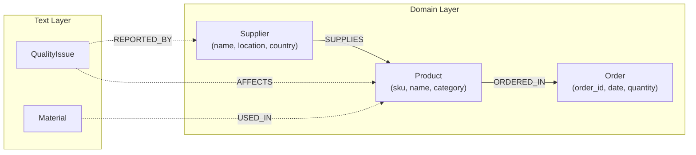

# US017: Mermaid Diagram Generation

## User Story

**As a** KG-Factory User
**I want** to generate Mermaid diagrams that visualize my knowledge graph schema and live graph structure at any point in the pipeline
**So that** I can see a visual representation of my graph after each change, understand the schema I'm building, and verify the graph structure matches my intent

## Story Points: 5

## Status: Not Started

## Acceptance Criteria

### Diagram Utility Module (`utils/mermaid.py`)

Core functions that generate Mermaid markup from state artifacts and Neo4j:

- [ ] `generate_schema_diagram(state: dict) -> str` — generates Mermaid from state artifacts
  - Reads `approved_construction_plan` for structured node/relationship types
  - Reads `approved_entity_types` for unstructured entity types
  - Reads `approved_fact_types` for unstructured relationship types
  - Renders nodes with their properties (top 5 properties, truncated if more)
  - Renders relationships with labels between source and target nodes
  - Visually distinguishes domain layer (solid lines) from text layer (dashed lines)
  - Returns empty string with message if no approved artifacts exist yet
  - Progressive: shows whatever is approved so far (plan only, plan + entities, plan + entities + facts)

- [ ] `generate_live_diagram(driver) -> str` — generates Mermaid from Neo4j graph
  - Queries `db.schema.visualization()` or equivalent Cypher for node labels, relationship types, and counts
  - Shows node labels with instance counts (e.g., `Supplier["Supplier (42)"]`)
  - Shows relationship types with counts (e.g., `-->|SUPPLIES (125)|`)
  - Distinguishes domain nodes from text layer nodes (Chunk, Document, `__Entity__`)
  - Includes bridging relationships (CORRESPONDS_TO) when present
  - Returns empty string with message if graph is empty

- [ ] `generate_combined_diagram(state: dict, driver) -> str` — generates both diagrams with headers
  - Calls `generate_schema_diagram` and `generate_live_diagram`
  - Returns both under clear section headers
  - Useful for comparing planned vs actual

### Mermaid Output Format

- [ ] Uses `graph LR` (left-to-right) layout for readability
- [ ] Node syntax: `NodeLabel["NodeLabel\n(prop1, prop2, ...)"]`
- [ ] Relationship syntax: `NodeA -->|REL_TYPE| NodeB`
- [ ] Text layer nodes use dotted lines: `NodeA -.->|REL_TYPE| NodeB`
- [ ] Bridging relationships use thick lines: `Entity ==>|CORRESPONDS_TO| DomainNode`
- [ ] Subgraphs for layer separation when both domain and text layers present:
  ```
  subgraph Domain Layer
    Supplier["Supplier\n(name, location)"]
    Product["Product\n(sku, name)"]
  end
  subgraph Text Layer
    Chunk["Chunk"]
    Entity["__Entity__"]
  end
  ```
- [ ] Sanitizes label names for Mermaid compatibility (no spaces, special chars escaped)
- [ ] Handles edge cases: self-referencing relationships, nodes with no relationships

### kg_diagram MCP Tool (`mcp_server/server.py`)

- [ ] Tool signature: `kg_diagram(scope: str = "auto") -> dict`
- [ ] Scope options:
  - `"schema"` — generates from state artifacts only (no Neo4j connection needed)
  - `"live"` — generates from Neo4j graph (requires connection)
  - `"auto"` (default) — generates schema if no graph built yet, live if graph exists, combined if both available
- [ ] Returns:
  ```python
  {
    "agent_response": "```mermaid\ngraph LR\n  ...\n```",
    "status": {
      "success": True,
      "scope": "schema" | "live" | "combined",
      "node_count": int,       # number of node types shown
      "rel_count": int,        # number of relationship types shown
    },
    "mermaid": str,            # raw Mermaid markup (without code fence)
  }
  ```
- [ ] Decorated with `@mcp.tool` and `@mcp_traceable(name="mcp.kg_diagram")`
- [ ] Schema scope: no Neo4j driver needed (reads state only)
- [ ] Live scope: uses `get_neo4j_driver()` / `close_driver()` pattern
- [ ] Auto scope: tries live first (if Neo4j available), falls back to schema

### Error Handling

- [ ] No state artifacts and no graph: Clear message with guidance to start the pipeline
- [ ] Neo4j unavailable for live scope: Falls back to schema with warning
- [ ] Graph empty (no nodes): Returns message suggesting to run `kg_build_graph`
- [ ] Very large graph (>50 node types): Truncates with note showing count of omitted types
- [ ] Invalid label names: Sanitized for Mermaid compatibility (no crash)

### Integration with Existing Tools (Optional Enhancement)

- [ ] `kg_schema_proposal` response includes a note that `kg_diagram` is available
- [ ] `kg_build_graph` response includes a note that `kg_diagram` is available
- [ ] No auto-injection of diagrams (user/Claude Code calls `kg_diagram` explicitly)

## Definition of Done

- [ ] Code implemented and working
- [ ] Unit tests for `generate_schema_diagram` (various state combinations)
- [ ] Unit tests for `generate_live_diagram` (mock Neo4j driver)
- [ ] Unit tests for `generate_combined_diagram`
- [ ] Unit tests for Mermaid sanitization and edge cases
- [ ] Unit tests for `kg_diagram` MCP tool (extract `_run_kg_diagram`, test directly)
- [ ] All existing tests still pass (360+ unit tests)
- [ ] MCP tool works from Claude Code
- [ ] Generated Mermaid renders correctly in GitHub markdown preview
- [ ] Observability: traces visible in LangSmith when enabled
- [ ] Code reviewed
- [ ] Documentation in code (docstrings for all public functions)

## Technical Notes

### Architecture

```
kg_diagram(scope="auto")
  |
  +-> _load_clean_state()
  |
  +-> Determine scope:
  |     - "schema"  -> generate_schema_diagram(state)
  |     - "live"    -> get_neo4j_driver() -> generate_live_diagram(driver)
  |     - "auto"    -> try live, fall back to schema, combine if both work
  |
  +-> Return: {agent_response (fenced mermaid), mermaid (raw), status}
```

### State Artifact to Diagram Mapping

```
approved_construction_plan     ->  Domain nodes + relationships (solid lines)
  {label: {construction_type,       Node: label, properties
   properties, unique_column,       Relationship: from -> to with rel_name
   from_node_label, ...}}

approved_entity_types          ->  Text layer entity nodes (dashed borders)
  {TypeName: {description,          Node: TypeName with description
   source, grounding_evidence}}

approved_fact_types            ->  Text layer relationships (dashed lines)
  {predicate: {subject_label,       Relationship: subject -.-> object
   object_label, description}}
```

### Neo4j Schema Query for Live Diagram

```cypher
// Get node labels with counts
CALL db.labels() YIELD label
MATCH (n) WHERE label IN labels(n)
RETURN label, count(n) AS count

// Get relationship types with counts and endpoint labels
MATCH (a)-[r]->(b)
WITH type(r) AS rel_type,
     [l IN labels(a) WHERE NOT l STARTS WITH '__'][0] AS from_label,
     [l IN labels(b) WHERE NOT l STARTS WITH '__'][0] AS to_label,
     count(*) AS count
RETURN from_label, rel_type, to_label, count
```

### Files to Create

```
utils/
  mermaid.py                    # NEW: Mermaid diagram generation functions

tests/
  unit/
    test_mermaid.py             # NEW: Unit tests for diagram generation
```

### Files to Modify

```
mcp_server/server.py            # UPDATE: Add kg_diagram MCP tool
                                #         Import from utils/mermaid.py
```

### Component Specifications

#### 1. Schema Diagram Generator (`utils/mermaid.py`)

```python
def generate_schema_diagram(state: dict) -> str:
    """Generate Mermaid diagram from approved state artifacts.

    Reads approved_construction_plan, approved_entity_types, and
    approved_fact_types to produce a schema-level diagram showing
    planned node types and relationships.

    Args:
        state: Pipeline state dict with approved_* keys

    Returns:
        Mermaid markup string (without code fences), or empty string
        if no approved artifacts exist.
    """
    plan = state.get("approved_construction_plan", {})
    entity_types = state.get("approved_entity_types", {})
    fact_types = state.get("approved_fact_types", {})

    if not plan and not entity_types:
        return ""

    lines = ["graph LR"]

    # Extract domain nodes and relationships from construction plan
    domain_nodes = {}
    domain_rels = []

    for key, entry in plan.items():
        if entry.get("construction_type") == "node":
            label = entry["label"]
            props = list(entry.get("properties", {}).keys())[:5]
            domain_nodes[label] = props
        elif entry.get("construction_type") == "relationship":
            domain_rels.append({
                "from": entry["from_node_label"],
                "to": entry["to_node_label"],
                "type": entry.get("rel_name", key),
            })

    # Build subgraphs if both layers present
    has_text_layer = bool(entity_types or fact_types)

    if domain_nodes and has_text_layer:
        lines.append("  subgraph Domain Layer")

    for label, props in domain_nodes.items():
        safe = _sanitize(label)
        prop_str = ", ".join(props) if props else ""
        if prop_str:
            lines.append(f'    {safe}["{label}\\n({prop_str})"]')
        else:
            lines.append(f'    {safe}["{label}"]')

    if domain_nodes and has_text_layer:
        lines.append("  end")

    # Text layer entities
    if has_text_layer:
        lines.append("  subgraph Text Layer")
        for type_name in entity_types:
            safe = _sanitize(type_name)
            lines.append(f'    {safe}["{type_name}"]')
        lines.append("  end")

    # Domain relationships (solid arrows)
    for rel in domain_rels:
        f = _sanitize(rel["from"])
        t = _sanitize(rel["to"])
        lines.append(f'  {f} -->|{rel["type"]}| {t}')

    # Fact types (dashed arrows)
    for predicate, fact in fact_types.items():
        f = _sanitize(fact["subject_label"])
        t = _sanitize(fact["object_label"])
        lines.append(f'  {f} -.->|{predicate}| {t}')

    return "\n".join(lines)
```

#### 2. Live Diagram Generator (`utils/mermaid.py`)

```python
def generate_live_diagram(driver) -> str:
    """Generate Mermaid diagram from live Neo4j graph.

    Queries the database for actual node labels, relationship types,
    and instance counts.

    Args:
        driver: Neo4j driver instance

    Returns:
        Mermaid markup string (without code fences), or empty string
        if graph is empty.
    """
    with driver.session() as session:
        # Get node labels with counts
        label_result = session.run("""
            MATCH (n)
            UNWIND labels(n) AS label
            RETURN label, count(DISTINCT n) AS count
            ORDER BY count DESC
        """)
        labels = [dict(r) for r in label_result]

        # Get relationship schema
        rel_result = session.run("""
            MATCH (a)-[r]->(b)
            WITH type(r) AS rel_type,
                 [l IN labels(a) WHERE NOT l STARTS WITH '__'][0] AS from_label,
                 [l IN labels(b) WHERE NOT l STARTS WITH '__'][0] AS to_label,
                 count(*) AS count
            RETURN from_label, rel_type, to_label, count
            ORDER BY count DESC
        """)
        rels = [dict(r) for r in rel_result]

    if not labels:
        return ""

    lines = ["graph LR"]

    # Classify labels into domain vs text layer
    text_labels = {"Chunk", "Document"}
    domain_labels = {}
    text_layer_labels = {}

    for row in labels:
        label = row["label"]
        count = row["count"]
        if label.startswith("__") or label in text_labels:
            text_layer_labels[label] = count
        else:
            domain_labels[label] = count

    # Truncate if too many
    if len(domain_labels) > 50:
        # ... truncation logic
        pass

    has_text = bool(text_layer_labels)

    if domain_labels and has_text:
        lines.append("  subgraph Domain Layer")

    for label, count in domain_labels.items():
        safe = _sanitize(label)
        lines.append(f'    {safe}["{label} ({count})"]')

    if domain_labels and has_text:
        lines.append("  end")

    if has_text:
        lines.append("  subgraph Text Layer")
        for label, count in text_layer_labels.items():
            safe = _sanitize(label)
            lines.append(f'    {safe}["{label} ({count})"]')
        lines.append("  end")

    # Relationships
    for rel in rels:
        f = _sanitize(rel["from_label"] or "Unknown")
        t = _sanitize(rel["to_label"] or "Unknown")
        rtype = rel["rel_type"]
        count = rel["count"]

        if rtype == "CORRESPONDS_TO":
            lines.append(f'  {f} ==>|{rtype} ({count})| {t}')
        elif f in [_sanitize(l) for l in text_layer_labels] or \
             t in [_sanitize(l) for l in text_layer_labels]:
            lines.append(f'  {f} -.->|{rtype} ({count})| {t}')
        else:
            lines.append(f'  {f} -->|{rtype} ({count})| {t}')

    return "\n".join(lines)
```

#### 3. Sanitize Helper

```python
def _sanitize(label: str) -> str:
    """Sanitize a label for use as a Mermaid node ID.

    Replaces spaces, special characters with underscores.
    Strips leading/trailing underscores.
    """
    import re
    safe = re.sub(r'[^a-zA-Z0-9_]', '_', label)
    safe = safe.strip('_') or 'Node'
    return safe
```

#### 4. MCP Tool (in `mcp_server/server.py`)

```python
@mcp.tool
@mcp_traceable(name="mcp.kg_diagram")
def kg_diagram(scope: str = "auto") -> dict:
    """Generate a Mermaid diagram of the knowledge graph.

    Visualizes graph schema from pipeline state and/or live Neo4j graph.

    Args:
        scope: What to diagram.
            "schema" - from approved state artifacts (no Neo4j needed)
            "live" - from actual Neo4j graph (requires connection)
            "auto" - schema if no graph, live if graph exists, combined if both

    Returns:
        Mermaid diagram markup with rendering metadata.
    """
    return _run_kg_diagram(scope)
```

### Example Output

#### Schema Diagram (after schema proposal + NER + fact extraction)



#### Live Diagram (after graph build)

```mermaid
graph LR
  subgraph Domain Layer
    Supplier["Supplier (42)"]
    Product["Product (89)"]
    Order["Order (1,203)"]
  end
  subgraph Text Layer
    Chunk["Chunk (340)"]
    __Entity__["__Entity__ (95)"]
  end
  Supplier -->|SUPPLIES (125)| Product
  Product -->|ORDERED_IN (1,203)| Order
  Chunk -.->|FROM_CHUNK (95)| __Entity__
  __Entity__ ==>|CORRESPONDS_TO (67)| Supplier
  __Entity__ ==>|CORRESPONDS_TO (28)| Product
```

## Dependencies

- Existing `core/state.py` (state management)
- Existing `utils/neo4j_utils.py` (driver management)
- Existing `core/tracing.py` (observability decorators)
- Existing MCP server patterns (`_load_clean_state`, `_save_state`)

## Out of Scope

- Interactive or clickable diagrams (static Mermaid markup only)
- Instance-level diagrams showing individual nodes/edges (would be too large)
- Auto-rendering to PNG/SVG (Mermaid is rendered by the consuming platform)
- Diagram persistence to file (returned in MCP response, Claude Code can save if needed)
- Diff diagrams (showing what changed between builds)
- Color theming or custom styling (use Mermaid defaults)
- Class diagrams or ER diagrams (graph LR is sufficient for knowledge graphs)
- Integration with Neo4j Browser visualization
